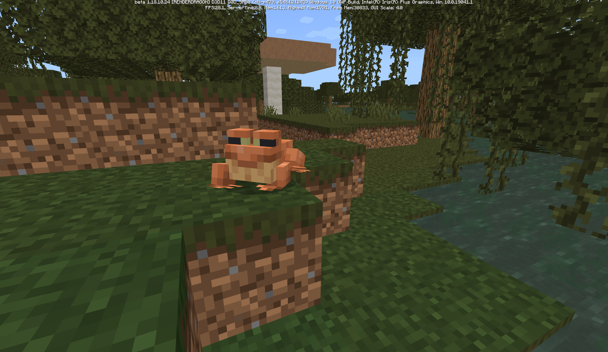
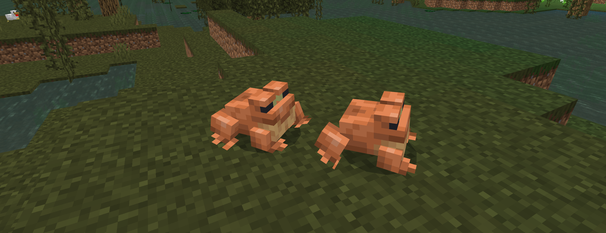
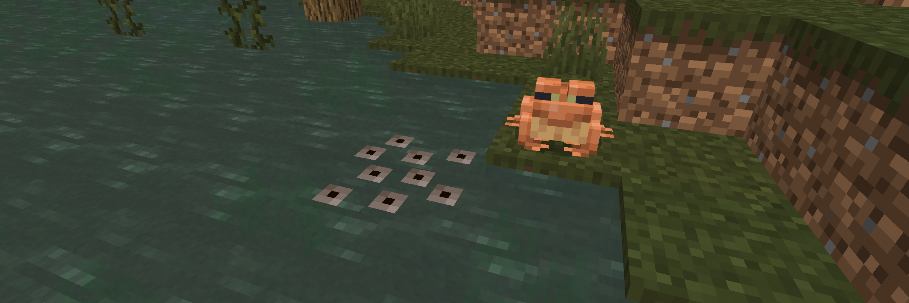
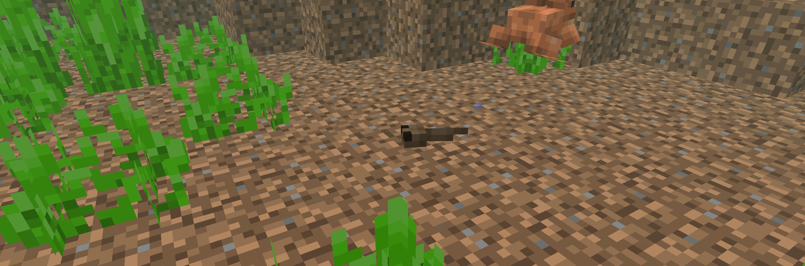
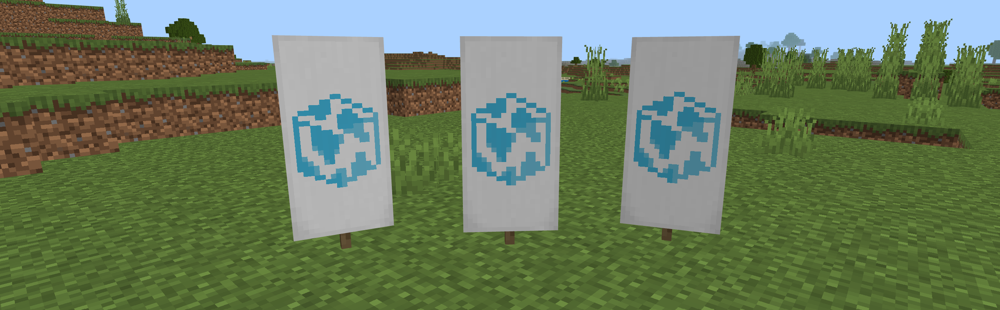

# 베드락 에디션 베타 1.18.10.24
## 개울가에 올챙이 한 마리 꼬물꼬물 헤엄치다 뒷다리가 쑥 앞다리가 쑥 팔짝팔짝 개구리됐네

{실험적} 변경 사항
=

개구리
-
* **늪지대 바이옴에서 스폰해요.**
* **작은 슬라임을 공격해요. 이를 이용해 슬라임 볼을 얻을 수도 있어요.**
* 가끔 개굴대고, 점프하기도 하며, 물에서는 수영하고 땅에서는 걸어다녀요.

* 해초(번역 확인)로 교배시킬 수 있어요. (확정은 아니고, 임시로 정해진거에요. 나중에 바뀔 수 있어요.)
* 교배시키면 물 위에 알을 낳아요.
* 알이 부화하면 올챙이가 스폰해요.

* **올챙이가 성장하여 개구리가 돼요.**
* **알이 부화한 바이옴에 따라 개구리의 종류가 달라져요.**
* 올챙이는 물 속에서 헤엄칠 수 있어요.
* 올챙이는 물고기와 같이, 물 안에서만 숨쉴 수 있어요.
* 개구리가 담긴 양동이도 있어요.
* [개구리 관련 피드백 남기기](https://aka.ms/MCFrogFeedback)

변경 사항
=
게임플레이
-
* 약탈자 우두머리를 죽여 '나쁜 징조'(번역 확인) 상태 효과를 얻을 때 더 이상 파티클이 나오지 않아요.
* 침대에 누워도 화면이 어두워지지 않던 버그가 고쳐졌어요. [MCPE-148504](BUG)
* 플레이어가 웅크렸을 때 카메라가 밑으로 내려가지 않던 버그가 고쳐졌어요. [MCPE-148482](BUG)

주민
-
* 이제 거래할 재고가 없으면 No 소리를 낼 거에요. [MCPE-113788](BUG)

그래픽
-
* **엔더 드래곤의 체력이 0이 되고 포탈 중앙으로 날아갈 때, 엔더 드래곤이 보이지 않던 버그가 고쳐졌어요.** [MCPE-149119](BUG)

안정성 및 호환성
-
* 마을 근처에서 벌어질 수 있는 충돌이 고쳐졌어요.
* Pocket UI 프로필을 사용중일 때 조합대(번역 확인)에서 Shift를 누른 채로 갑옷을 클릭하면 일어나던 충돌이 고쳐졌어요. [MCPE-144863](BUG)

UI
-
* 서바이벌 모드에서 갑옷을 입고 아이템을 들었을 때 아이템 이름 표시 상자의 안쪽 여백이 추가되었어요.
* 문구 중 버튼 기호가 포함되어 있을 때 문구에 적용된 그림자가 약해지던 버그가 고쳐졌어요.

자바 에디션과 일치
-
* **베드락 에디션에도 지구본 배너 무늬(Globe)가 나왔어요!**

명령어
-
* **`/kill` 명령어에 흡수 상태 효과가 있는 엔티티는 죽지 않던 버그가 고쳐졌어요.** [MCPE-142763](BUG)
* 당나귀나 노새에 달린 상자에 `/replaceitem` 명령어를 사용했을 때 이상한 칸으로 아이템이 가던 버그가 고쳐졌어요.

교육용 기능
-
* **다양한 몹에게 풍선을 붙일 수 있어요:** 아홀로틀, 벌, 보트, 고양이, 돌고래, 발광 오징어, 염소, 호글린, 철골렘, 오실롯, 판다, 앵무새, 돼지, 북극곰, 오징어, 스트라이더, 여우, 조글린

기술적 변경 사항
=

안드로이드
-
* **Android : API 버전이 30으로 올라갔어요.**

명령어
-
* **함수에서 스케쥴 명령어를 실행할 때 더 이상 충돌이 발생하지 않아요.** [MCPE-144730](BUG)

데이터 구성 몹
-
* 어른 오실롯이 아기 오실롯 두 마리와 함께 자연 스폰될 확률도 [JSON](entity%20JSON%20definition)에서 추가한 컴포넌트에서 조정할 수 있어요.

Molang
-
* **다른 엔티티의 존재하지 않는 변수에 접근할 때, 더 이상 에러나지 않고 대신 0.0이 나와요.**
* 공개(public) 변수 이름에 대문자가 들어가 있으면 에러가 나던 버그가 고쳐졌어요.
* WearableItemComponent의 슬롯 옵션으로 `slot.equippable`이 추가되었어요.

`RandomStrollGoal`
-
성능이 향상되었어요.

{실험적 기능} 게임테스트 프레임워크
-

|클래스|변화|종류|이름|설명|
|:-:|:-:|:-:|:-:|:-:|
|Dimension|변경|함수|spawnEntity|이제 Location이나 BlockLocation을 인자로 받아요.|
|BlockBreakEvent|추가|속성|brokenBlockPermutation|어떤 종류의 블록이 부숴졌는지를 알려줘요.|

### [공식 변경 로그](https://www.minecraft.net/en-us/article/minecraft-beta-1-18-10-24) | [마인크래프트 위키](wiki/beta_1.18.10.24)