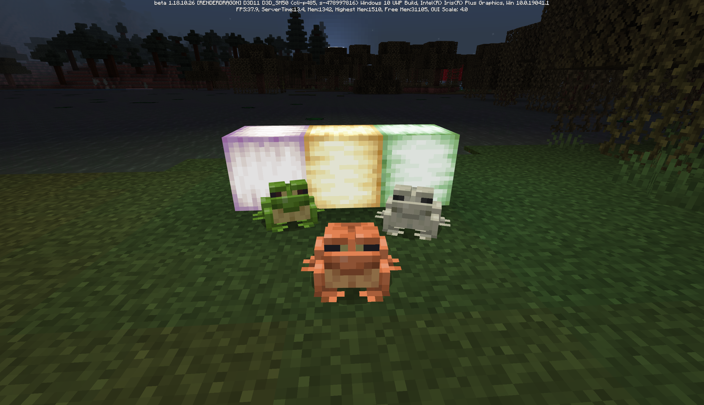
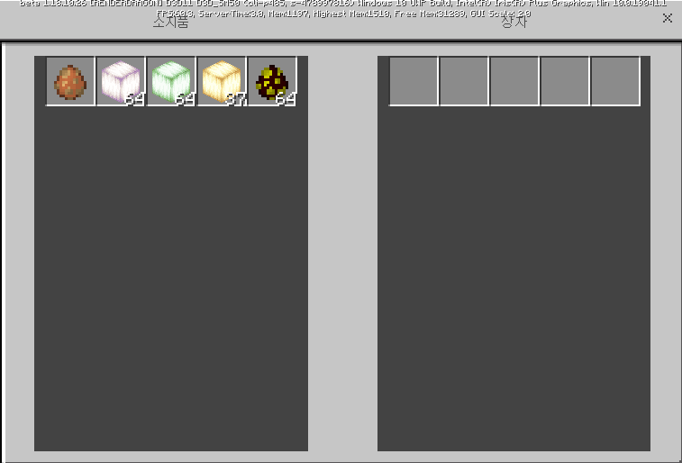
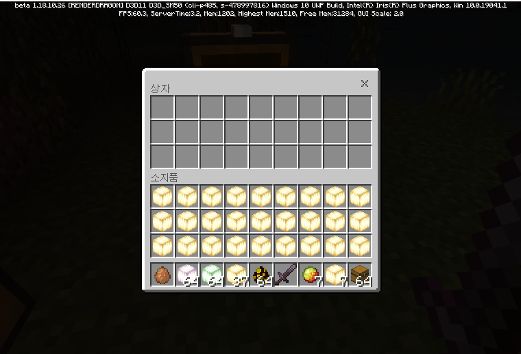
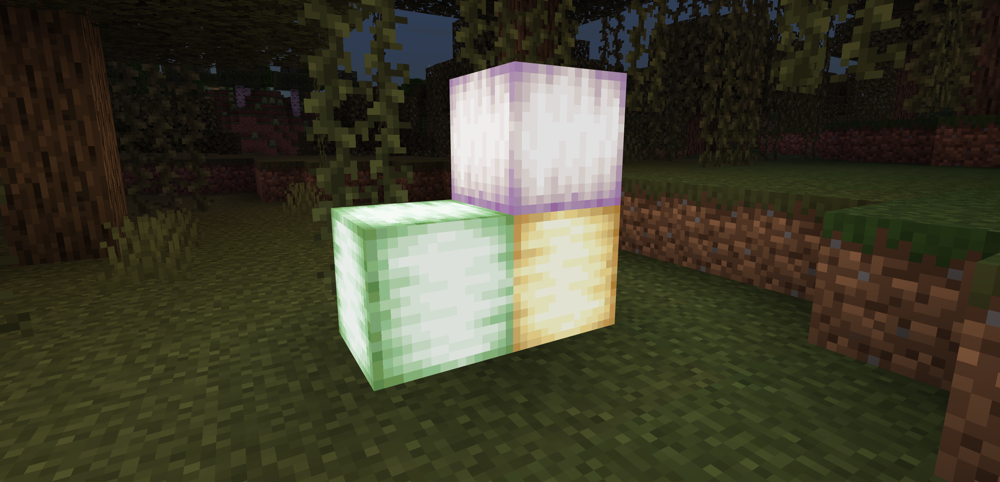
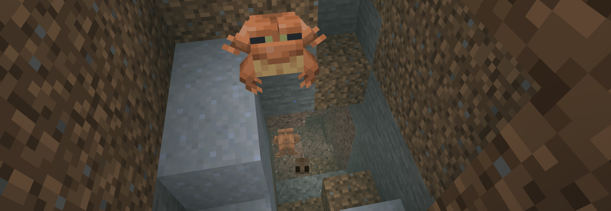
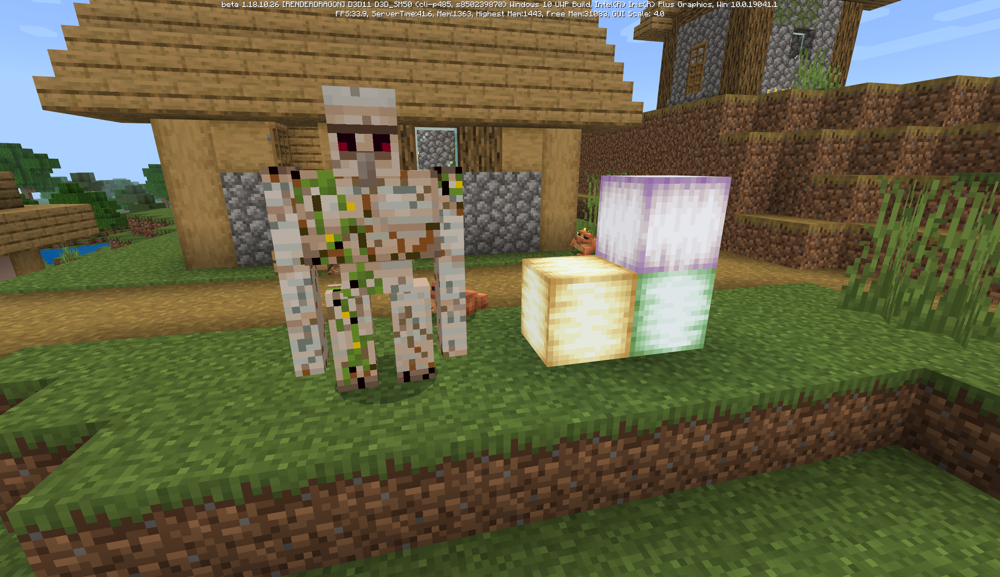
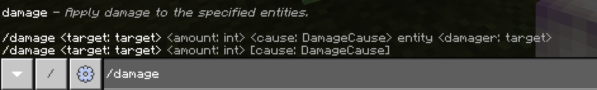
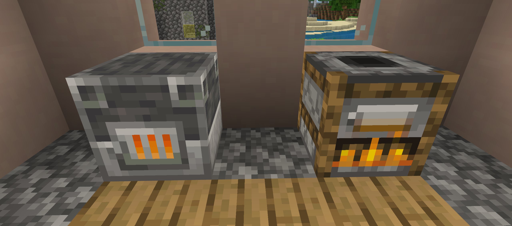
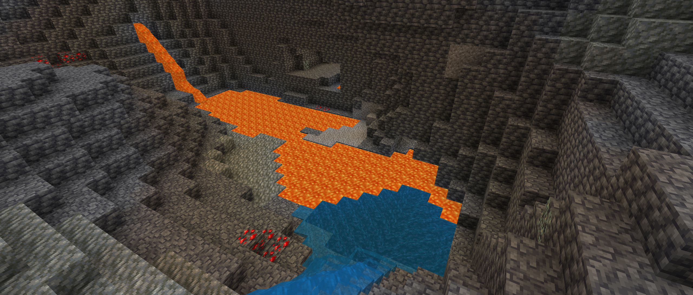

# 베드락 에디션 베타 1.18.10.26
## 마그마 큐브가 조명이 되는 순간

이번 베타에 포함된 오류
=

* Pocket UI (왼쪽) / 클래식 UI (오른쪽)

* **Pocket UI를 사용할 때 상자의 모든 아이템이 보이지 않을 수 있어요.**
* 설정 -> 비디오 -> UI 프로필을 '클래식'으로 설정하여 임시방편으로 해결할 수 있어요.

실험적 변경 사항
=

개굴빛
-
* **빛이 나는 블록으로, 진주색, 초록색, 황토색의 세 종류가 있어요.**
* 개구리를 작은 마그마 큐브 근처로 유인해서, 개구리가 작은 마그마 큐브를 공격하면 이 블록이 떨어져요. 개구리의 종류에 따라 블록의 종류가 결정된답니다.

개구리
-
* 개구리와 올챙이에게 소리가 추가되었어요. [MCPE-150742](BUG)
* 개구리가 공격받았을 때 반응 속도가 적절하게 수정되었어요.
* 올챙이에게 공격받음 목표가 추가되었어요.

개구리 알
-
* 발광 이끼는 더 이상 개구리 알 위에 설치될 수 없어요.

변경 사항
=

자바 에디션과 일치
-
* **철골렘의 체력에 따라 몸에 균열이 일어나요.** (철괴로 체력을 회복시켜줄 수 있답니다. [MCPE-74081](BUG))
* **도살자, 지도 제작자, 사서, 떠돌이 상인의 거래 품목이 변경되었어요.**
* 발광 이끼의 밝기가 자바 에디션과 동일하게 적용되었어요.
* 여우가 점프할 때 아래를 바라봐요. [MCPE-143664](BUG)
* 거래할 때 주민 위에 뜨던 에메랄드 아이콘이 사라졌어요.
* 마을에서 플레이어가 주민을 공격했을 때, 플레이어가 평판이 매우 안좋을 경우에만 철골렘이 플레이어를 공격해요.

명령어
-
* **엔티티에게 데미지를 줄 수 있는 `/damage` 명령어가 추가되었어요.** 사용법: /damage <대상 엔티티> <피해 정도> [피해 요인] [\<entity> <피격자>]
* `/setblock`이나 `/fill` 명령어로 코코아 콩을 놓을 때 더 이상 에러가 나지 않아요.

안정성 및 성능
-
* **월드를 나갈 때, 특정 청크의 엔티티가 저장되지 않던 [버그](https://www.koreaminecraft.net/update/3018022)가 고쳐졌어요.** [MCPE-144208](BUG)
* 특정 시드나 월드에서 메사 바이옴을 로딩하던 중 발생하던 충돌이 고쳐졌어요. [MCPE-149659](BUG)

화로
-
* **용광로와 발연물에서 경험치가 나오지 않던 버그가 고쳐졌어요.** [MCPE-150427](BUG)

게임플레이
-
* **이제 용암 호수가 y=0 이상에만 생겨요.** [MCPE-146459](BUG) (y=0에 가까운 호수는 주변을 둘러싸는 돌이 딥슬레이트로 바뀌어 있을 수 있어요.)
* **설치 버튼을 꾹 누른 채로 음직여도 빛 블록이 연달아 설치되지 않던 버그가 고쳐졌어요.** [MCPE-135669](BUG)
* 거대한 종유석과 석순에 이제 가끔 뾰족한 드립스톤이 생성되요. [MCPE-128128](BUG)
* 산호는 이제 따뜻한 바다의 더욱 깊은 곳에서만 나와요. [MCPE-147399](BUG)
* 이제 절벽 바이옴에 다양한 종류의 나무들이 생겨요. [MCPE-148361](BUG)
* VR 기기에서 빛 블록 밝기를 바꿀 수 없던 버그가 고쳐졌어요.
* 주위에 몹이 많을 때 블럭 파괴, 상자 열기, 차원문 출입이 렉걸리거나 진행되지 않던 버그가 고쳐졌어요. [MCPE-149214](BUG)
* 잔디와 두칸 높이의 꽃이 부숴질 때 애니메이션이 올바르게 수정되었어요. [MCPE-150786](BUG)
* 꽃이 눈과 겹쳐져 있을 때 폭발에 휘말리지 않던 버그가 고쳐졌어요. [MCPE-146492](BUG)
* 스켈레톤 말이 길을 제대로 찾지 못하던 버그가 고쳐졌어요. [MCPE-147521](BUG)

월드 생성
-
* 빙산이 생성되는 과정에서 이글루의 눈을 덮어버리던 버그가 고쳐졌어요. [MCPE-147690](BUG)
* 산 속 동굴에 노출된 물이 생길 확률이 줄어들었어요. [MCPE-149417](BUG)
* 대수층에 물이 없던 버그가 고쳐졌어요없을거에요. [MCPE-146452](BUG)

기능 변경
-
* 커다란 드립스톤은 더 이상 용암 위에 생기지 않아요.
* 뾰족한 드립스톤 무리에서 이제 석순은 항상 한 블럭 이상의 높이를 가져요.

접근성
-
* 나레이터(TTS) 기능이 이제 실험적 기능의 이름을 제대로 읽어줘요.

기술적 변경 사항
=

블록
-
* '같은 이름, 다른 코드'를 가지고 있는 블록을 이제 지원해요.

UI (사용자 인터페이스)
-
* 리소스팩 설정 화면에서 위/아래 버튼이 활성화되었을 때 크기가 커지던 버그가 고쳐졌어요. [MCPE-147708](BUG)

기타
-
* **`whitelist` -> `allowlist` 변경 사항이 다시 한번 적용되었어요.** [BDS-1419](BUG)

애니메이션
-
* 애니메이션 컨트롤러 반복 확인 시스템이 정상적인 반복 사용까지 잘못 막아버리던 버그가 고쳐졌어요.

`JumpToBlockGoal`
-
* 이제 `jumpblockcandidates`를 찾을 때 위아래로 같은 거리만큼 검색해요. (이로써 몹이 동일한 높이만큼 점프할 수 있도록 해줘요.)

{실험적 기능} 게임테스트 프레임워크
-

|클래스|변화|종류|이름|설명|
|:-:|:-:|:-:|:-:|:-:|
|Entity|추가|함수|teleport(location: Location, dimension: Dimension, xRotation(선택): float, yRotation(선택): float)|
||||teleportFacing(location: Location, dimension: Dimension, facingLocation: Location)|
|-||메소드|registerAsync|게임테스트 상태를 비동기적으로 등록하고 추적할 수 있어요.|

### [공식 변경 로그](https://feedback.minecraft.net/hc/en-us/articles/4418784338829) | [마인크래프트 위키](wiki/beta_1.18.10.26)