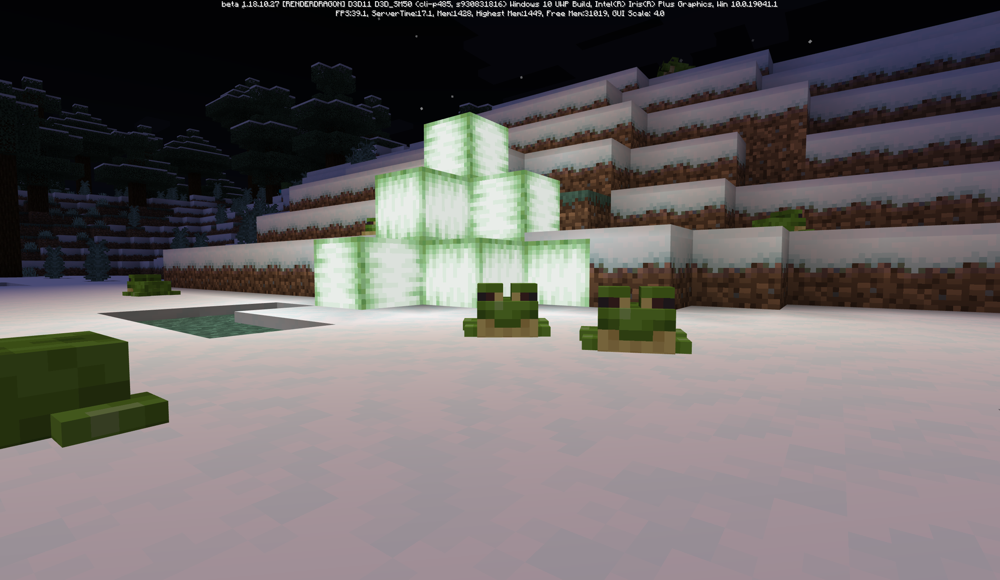
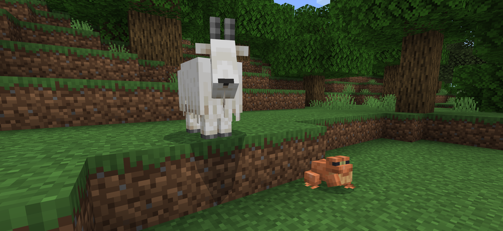
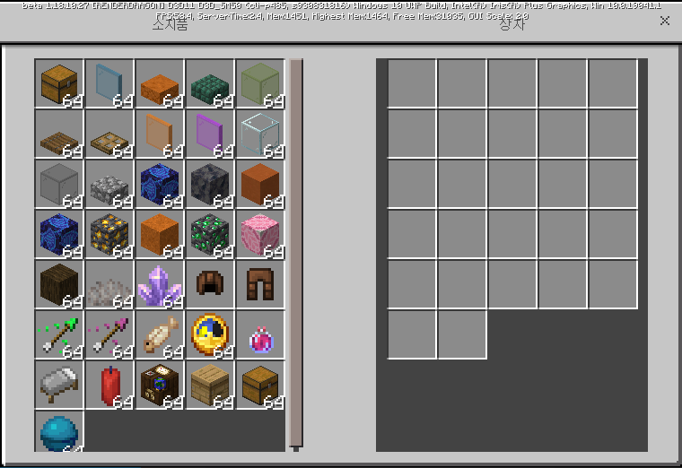
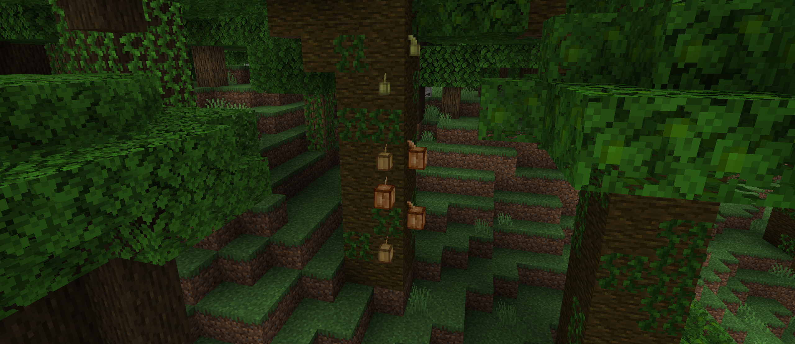
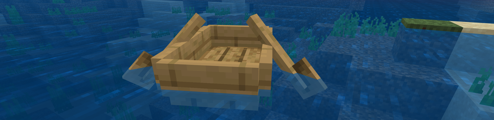

# 베드락 에디션 베타 1.18.10.27
## 개구리가 왜 염소를 먹어ㅋㅋㅋㅋ

{실험적 기능} 변경 사항
=

개구리
-
* 개구리가 더 이상 [염소를 먹지](https://www.koreaminecraft.net/free/3036020) 않아요. [MCPE-151536](BUG)

변경 사항
=

UI (사용자 인터페이스)
-
* **UI 프로필을 Pocket으로 사용할 때, 일부 인벤토리가 표시되지 않던 버그가 고쳐졌어요.**
* Pocket UI의 '건축' 인벤토리 탭의 색이 투명해지던 버그가 고쳐졌어요. [MCPE-151545](BUG)
* 크리에이티브 인벤토리의 빈 인벤토리 슬롯이 월드에서 상호작용 문제을 일으키던 버그가 고쳐졌어요. [MCPE-151506](BUG)

블록
-
* **청크 경계선에 설치된 코코아 열매가 월드를 다시 불러올 때 파괴되던 버그가 고쳐졌어요.** [MCPE-67479](BUG)
* 구조물 블록이 이제 여러 면에 설치될 수 있는 블록을 제대로 변형해요. (회전/반전 등, 예: 발광 이끼)

월드 생성
-
* 상자와 몬스터 생성기가 구조물에서 제대로 생성되어요. [MCPE-23416](BUG) [MCPE-48622](BUG) [MCPE-97295](BUG)

게임플레이
-
* 관찰자가 켜진 상태로 파괴되었을 때 불이 켜진 상태의 관측기 아이템이 떨어지던 버그가 고쳐졌어요.
* 그림이 아이템 액자, 표지판, 배너, 횃불 위로 겹쳐질 수 있던 버그가 고쳐졌어요.
* 약탈자 기지에서 이제 올바른 수의 약탈자와 골렘이 생성되어요. [MCPE-141499](BUG)

그래픽
-
* 보트를 장시간 탑승한 이후 내리면 보트가 갑자기 사라지던 버그가 고쳐졌어요. [MCPE-108568](BUG) [MCPE-125388](BUG)
* 보트 노 부분의 색이 보트 본체와 동일하게 변경되었어요. [MCPE-150492](BUG)

몹
-
* 길들이지 않은 고양이에게도 끈을 매달 수 있어요.
* 가디언과 엘더 가디언이 적을 포착했을 때 더 이상 가라앉지 않아요.

기술적 변경 사항
=

기타
-
* 동굴과 절벽 업데이트 이전 버전의 평지맵 월드 템플릿을 사용할 때,
* `format_versions`가 숫자일 때 제대로 읽어들이지 못하던 버그가 고쳐졌어요.

안정성 및 성능
-
* [틱%20구역](Ticking area)의 메모리 용량과 로딩 시간을 줄였어요.

Molang
-
* `query.all`과 `query.any`가 새로 생겼어요. 주어진 값과 모두 일치하는지(all) 또는 일치하는 것이 하나라도 있는지(any) 알려줘요.
* `query.in_range`가 새로 생겼어요. 주어진 값이 최솟값과 최댓값 사이에 포함되는지 알려줘요.

애니메이션
-
* 주어진 이벤트 시간이 [전체%20애니메이션%20길이](Total%20"animation%20length")과 동일하면 애니메이션 이벤트, 음향 효과 이벤트, 입자 이벤트가 발생하지 않던 버그가 고쳐졌어요.
* [애니메이션%20길이](animation_length)가 올바르게 정해지지 않으면 애니메이션 길이 연산에 이벤트 시간이 포함되지 않던 버그가 고쳐졌어요.

{실험적 기능} 게임테스트 프레임워크
-
|변화|종류|이름|설명|
|:-:|:-:|:-:|:-:|
|추가|함수|setVelocity(velocity: Vector) : bool|엔티티의 속도를 정할 수 있어요.|
||속성|viewVector : Vector|엔티티가 바라보고 있는 방향 (벡터)|
|||headLocation : Location|엔티티 머리 위치|
|||bodyRotation : number|엔티티 몸통 회전도 (º도)|

### [공식 변경 로그](https://feedback.minecraft.net/hc/en-us/articles/4420146557325-Minecraft-Beta-1-18-10-27-Xbox-Windows-Android-) | [마인크래프트 위키](wiki/beta_1.18.10.27)
