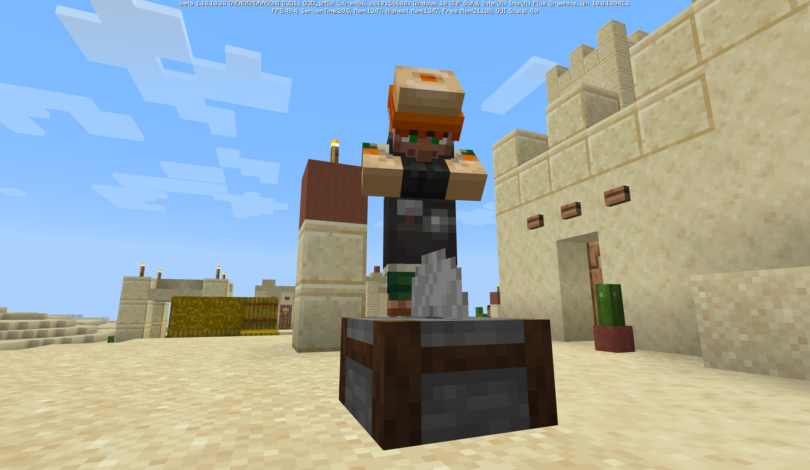

# 베드락 에디션 베타 1.18.10.28
## 그저 버그 수정일 뿐!

변경 사항
=

성능 및 안정성
-
* 유저 데이터 없이 없이 주민의 노획물 목록을 계산할 때 가끔 발생하던 충돌이 고쳐졌어요.
* 몇몇 충돌이 고쳐졌어요.

길찾기
-
* 몇몇 마켓플레이스 팩에서 "원거리 공격 목표"에 몹의 음직임이 영향받지 않던 버그가 고쳐졌어요.

UI
-
* Nintendo Switch : 플레이 메뉴에서 나가기 버튼을 이제 화면 터치로도 누를 수 있어요.
* 돌 절단기 화면에서 패턴을 바꿀 때 발생하던 충돌이 고쳐졌어요.

기술적 변경 사항
=

기타
-
* 아이템 스택의 설치/파괴 규칙에서 블록 네임스페이스가 기록되지 않던 버그가 고쳐졌어요.

### [ [공식 변경 로그](https://feedback.minecraft.net/hc/en-us/articles/4422108163725) | [마인크래프트 위키](wiki/beta_1.18.10.28) ]