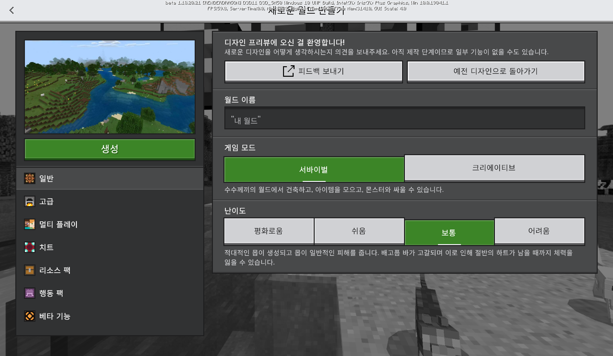
# 베드락 에디션 베타 1.18.20.21
## 새로운 인터페이스의 등장, 자바 에디션과 시드 통합!

{실험적 기능} 변경 사항
=

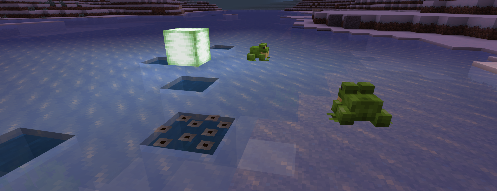
개구리
-
* **'개구리 알'의 이름이 '개구리 생성'으로 변경되었어요.**
* **개구리 생성이 올챙이로 부화할 때까지의 시간이 늘어났어요.**
* 이제 더 자주 점프해요.
* 올챙이의 히트박스가 더 커졌어요.
* 개구리 생성의 텍스쳐가 업데이트되었어요.
* 목초지 바이옴에서 생성되는 개구리의 종류가 변하지 않던 버그가 고쳐졌어요.

애니메이션 변화
-
* **개구리가 점프하는 애니메이션과 잡아먹는 애니메이션이 변경되었어요.**
* 애니메이션, 엔티티, 컨트롤러 파일이 깔끔하게 정리되었어요.
* 수영 모션과 물이 흐르는 애니메이션이 부드럽게 음직이도록 변경되었어요.

변경 사항
=

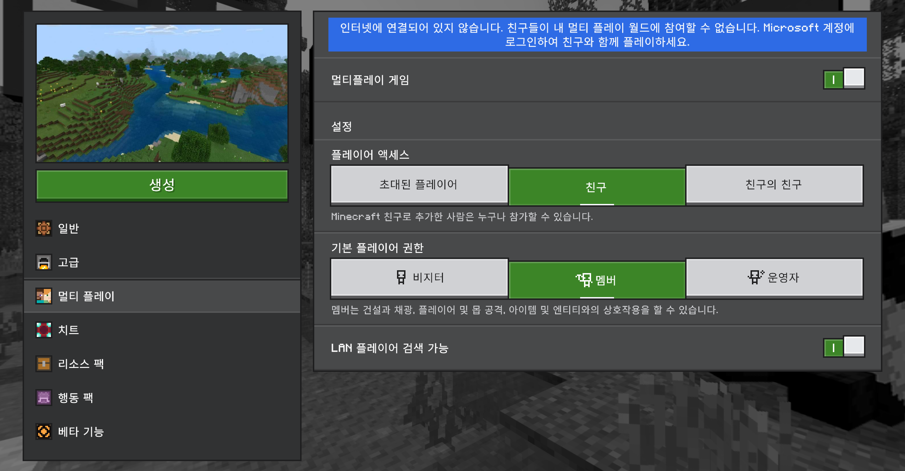
새로운 월드 만들기
-
* 새단장된 '새로운 월드 만들기' 화면이 일부 유저들을 대상으로 공개되었어요. (사용해보시고 [피드백](http://aka.ms/MCCreateNewWorldUI)을 보내주세요!)

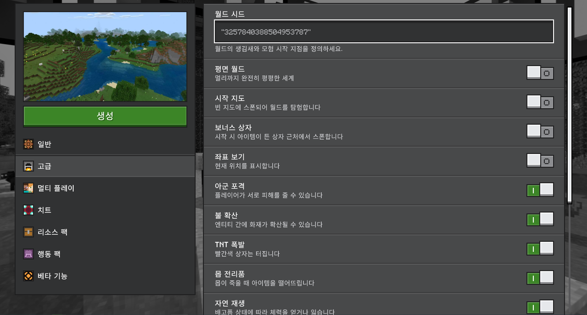
자바 에디션과 일치
-
* **월드 시드의 범위가 64비트 int형(-9223372036854775808~9223372036854775807) 으로 늘어났어요. 그리고 이 시드는 자바 에디션에서도 동일한 지형으로 사용할 수 있어요!** [MCPE-144994](BUG) [MCPE-148168](BUG)
* **숫자가 아닌 시드도 이제 자바 에디션과 동일한 지형으로 사용할 수 있어요.**
* 활을 장전할 때 더 이상 플레이어의 팔이 들썩이지 않아요. [MCPE-148486](BUG)
* 떨어지는 블록의 히트박스가 다시 블록 한 칸의 부피가 되었어요.
* 성직자 장인이 발광석 대신 발광석 가루를 거래 품목에 올리던 버그가 고쳐졌어요. [MCPE-57524](BUG)
* 길들이지 않은 늑대에도 끈을 매달 수 있어요. [MCPE-82050](BUG)

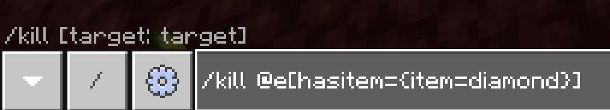
명령어
-
* **엔티티 선택자에 `hasitem` 옵션이 추가되었어요.** 이를 이용하여 특정 아이템을 가지고 있는 엔티티만 선택할 수 있어요.

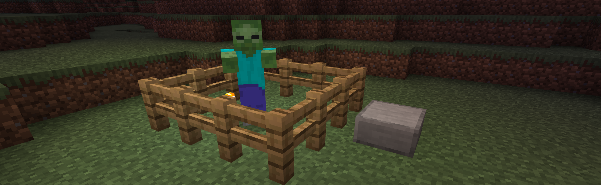
몹
-
* **몹이 근처의 판을 이용하여 울타리를 넘을 수 있어요.**
* **대구, 연어, 복어, 열대어, 돌고래가 바다 바이옴의 깊은 곳에 생성되지 않던 버그가 고쳐졌어요. [MCPE-150191](BUG)**
* 몹이 철쭉을 경로에 참고하지 않던 버그가 고쳐졌어요. [MCPE-129373](BUG)
* 몹이 드립리프 블록을 경로에 참고하지 않던 버그가 고쳐졌고, 완전히 기울어지지 않았다면 위를 지나갈 수 있어요.
* 몹이 뾰족한 드립리프를 넘어서 보지 못하거나, 경로에 참고하지 않던 버그가 고쳐졌어요. [MCPE-133270](BUG)
* 몹이 온전하지 않은 블록(예: 종, 양조기, 마법부여대 등) 위를 지나갈 수 있어요.
* 몹이 온전하지 않은 블록에서 온전한 블록으로 점프할 수 있어요.
* 몹이 충분히 지나갈 수 있는데도 반칸 이하로 쌓인 눈으로 인해 지나가지 못하던 버그가 고쳐졌어요. [MCPE-148355](BUG)
* 몹이 산호와 산호초를 더 이상 장애물로 여기지 않고 지나가요. [MCPE-128687](BUG)
* 생성 알을 들고 있을 때 주민과 거래하지 못하던 버그가 고쳐졌어요. [MCPE-76153](BUG)
* 레이드 적군으로 생성된 마녀는 더 이상 레이드 중 디스폰하지 않아요. [MCPE-149883](BUG)

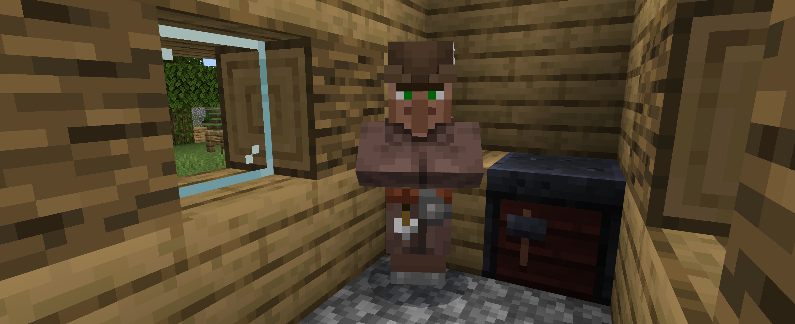
주민
-
* **갑옷 제조자, 성직자, 어부, 양치기, 도구 제조인, 무기 제조인의 거래 품목을 자바 에디션과 일치시켰어요.**
* **주민이 더 이상 씨앗과 비트 씨앗을 공유하지 않아요.**
* 주민이 거래하고자 하는 아이템을 손에 들지 않던 버그가 고쳐졌어요. [MCPE-150303](BUG)
* 주민이 더 이상 조글린을 피하지 않아요. [MCPE-94102](BUG)

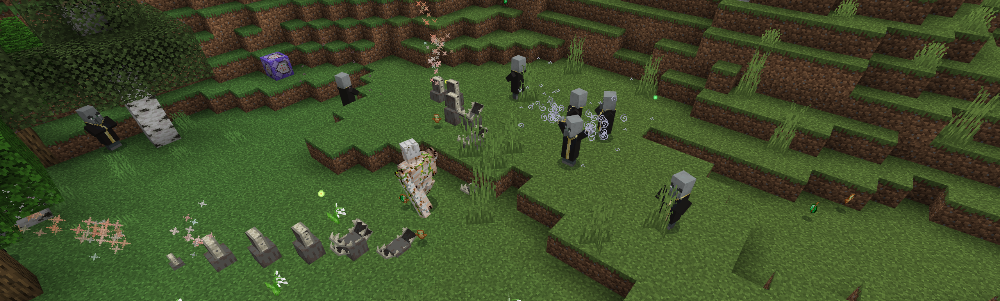
게임플레이
-
* 소환사 송곳니가 뚜렷한 경계면이 없는 블록에서는 생성되지 않던 버그가 고쳐졌어요.
* 한 칸에 물과 함께 공존할 수 있는 블록들(예: 빛블록, 큰 드립리프)에 물이나 용암 양동이를 사용할 수 있어요. [MCPE-148392](BUG)
* 방문자(비지터) 모드의 플레이어는 광물 수레와 그림을 부술 수 없어요. [MCPE-132869](BUG)
* 시야 범위보다 더 많이 수직(y축)으로 순간이동해도 지형이 제대로 로드돼요. [MCPE-150021](BUG)
* 피해 연산의 정확성이 높아졌어요.
* 장전 가능한 아이템을 들고 종을 치려고 할 때 종을 연속하여 칠 수 없던 버그가 고쳐졌어요. [MCPE-56968](BUG)
* 무언가에 타고 있을 때 딱지날개로 날고 있는 상태로 바꿀 수 있던 버그가 고쳐졌어요. [MCPE-147904](BUG)

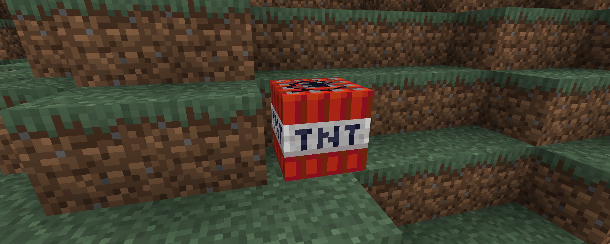
블록
-
* TNT가 점화될 때 임의의 x/z 방향으로 약간 음직여요.
* 블록을 빠르게 파괴했다 설치하였을 때 리소스가 누락되며 까맣게 보이던 버그가 고쳐졌어요.
* 눈 위로 떨어질 때 눈이 설치된 기반 블록과 함께 갑자기 부숴지던 버그가 고쳐졌어요.

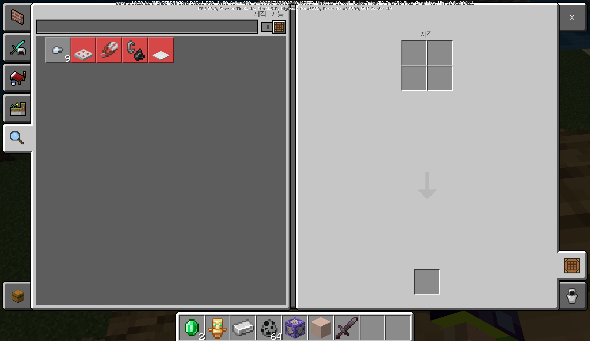
인터페이스
-
* Pocket UI 프로필 화면에서 기본 선택 탭이 '왼쪽: 제작 가능', '오른쪽: 제작'으로 변경되었어요.
* Pocket UI 프로필의 인벤토리 화면에서 물음표 버튼이 없어졌어요.
* 작업대를 제외한 다른 제작 화면에서 더 이상 3x3 조합법이 제시되지 않아요.
* Pocket UI 프로필의 제작대 화면에서 갑옷을 입거나 벗기 위해 자동 이동을 사용할 수 있어요. [MCPE-148970](BUG)
* 모바일에서 기본 컨트롤러 버튼 아이콘이 업데이트되었어요.
* Ctrl + Backspace : 커서 앞에 있는 모든 단어를 지워요.
* Ctrl + Delete : 커서 뒤에 있는 모든 단어를 지워요.
* Ctrl + ← : 커서 앞에 있는 단어 앞으로 커서를 옮겨요.
* Ctrl + → : 커서 뒤에 있는 단어 뒤로 커서를 옮겨요.

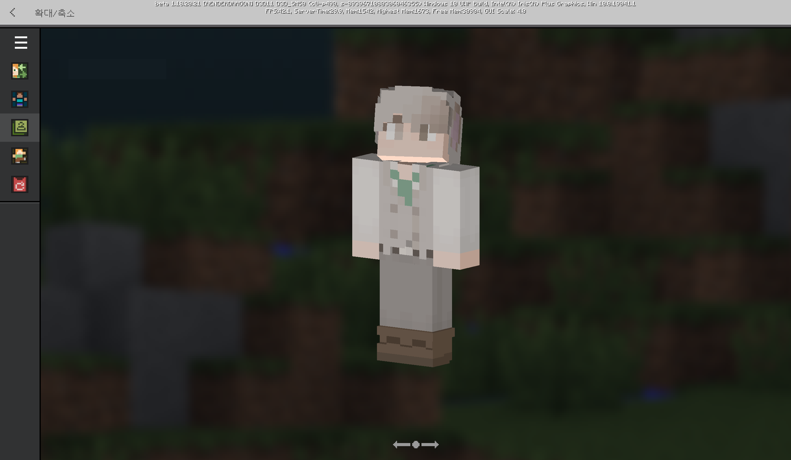
안정성 및 호환성
-
* 탈의실의 확대 화면에서 나갈 때 발생할 수 있던 충돌이 고쳐졌어요.

{실험적 기능} 기술적 변경 사항
=

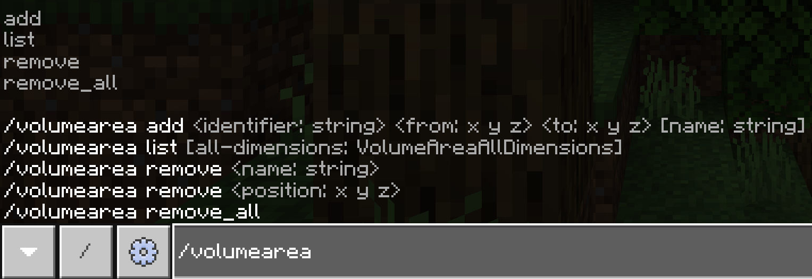
명령어
-
* `/volumearea` 명령어가 추가되었어요.  월드에 볼륨을 만들거나 제거하고 표시할 수 있어요.

게임테스트 프레임워크
-

* **새로운 모듈 : mojang-minecraft-ui**
* 간단한 [팝업 창](Dialog%20Boxes)을 띄울 수 있는 API 구조가 새로 추가되었어요!
* `ActionFormData`/`ModelFormData`/`MessageFormData` 종류가 추가되었어요. (자세한 내용은 [여기](https://aka.ms/buildwithminecraft)를 참고해주세요.)

* 자세한 게임테스트 프레임워크의 변경 사항은 공식 변경 로그를 참고해주세요.

기술적 변경 사항
=

* `StorageVersion`값이 8 이하인 월드는 9로 업그레이드될 거에요. `RandomSeed`의 32비트 범위가 64비트로 변경될거에요. (시드 값은 변하지 않아요. 이는 부호 처리가 필요한 음수 32비트 시드에만 적용되어요.)

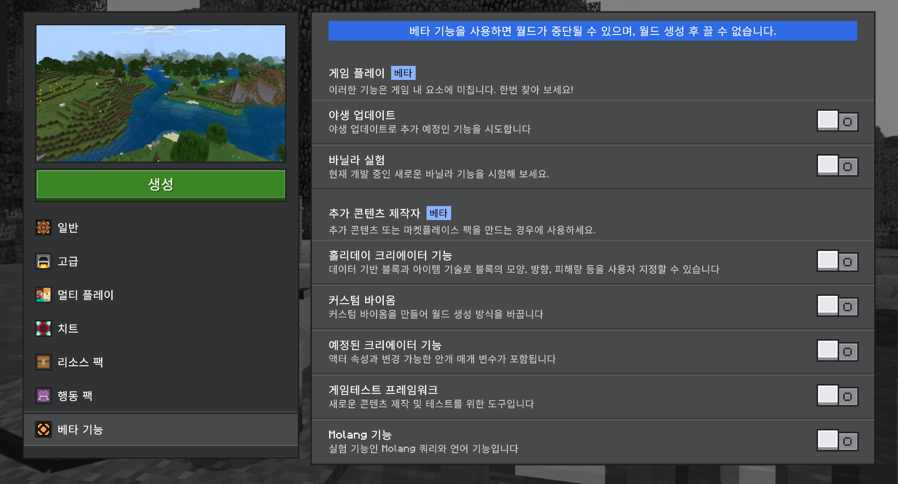
{실험적 기능} 추가 모딩 역량 & 자바스크립트 API
-
* **이번 베타부터 '추가 모딩 역량' 실험적 기능이 사라져요.** 2018년에 추가된 이 자바스크립트 API는 사라질 예정이며, 월드에서 더 이상 해당 기능이 작동하지 않아요.
* **다른 자바스크립트 API인 게임테스트 프레임워크와, 리소스 팩과 행동 팩은 영향을 받지 않아요.**
* 자세한 사항은 [여기](https://www.koreaminecraft.net/update/3073157)를 참고해주세요.

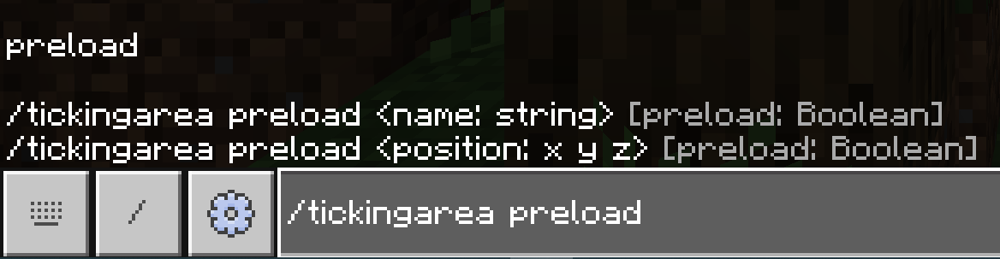
명령어
-
* `/tickingarea` 명령어에 `preload` 옵션이 추가되었어요. (해당 지역에 있는 모든 엔티티가 계속 로딩되고 틱 시간도 흐를거에요.)

인터페이스
-
* 틱 구역을 먼저 로드할 때도 로딩 화면이 떠요.

Molang
-
* 애니메이션 스크립트 중 행동자 리소스 정의(`pre_animation` 및 `initialize`)에서 대문자를 포함한 Molang 표현도 `format_version` 1.18.20 이상에서 제대로 계산돼요.

### [공식 변경 로그](https://feedback.minecraft.net/hc/en-us/articles/4423151445901) | [마인크래프트 위키](wiki/beta_1.18.10.21)
