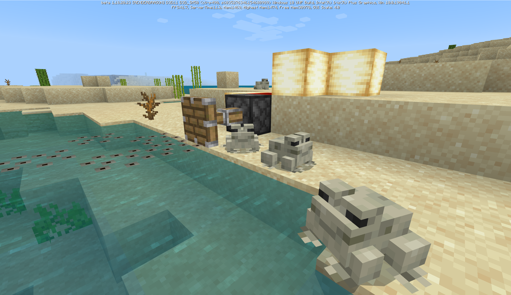
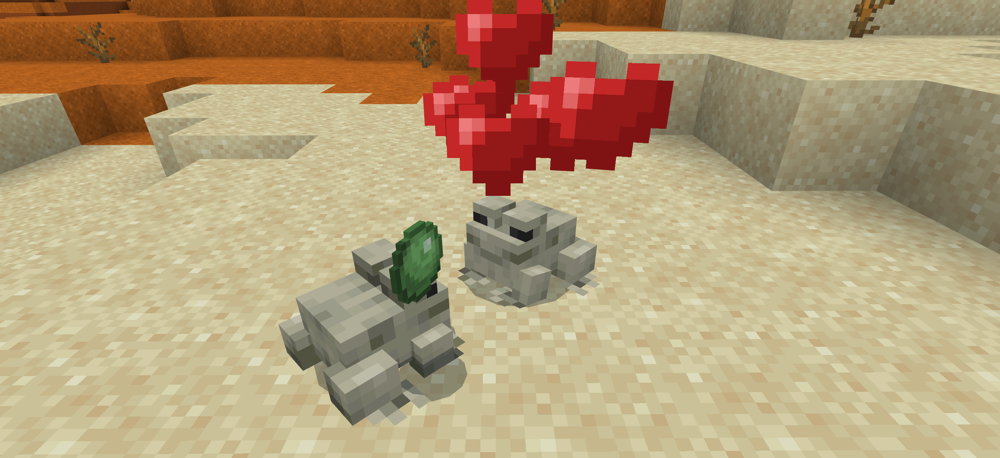
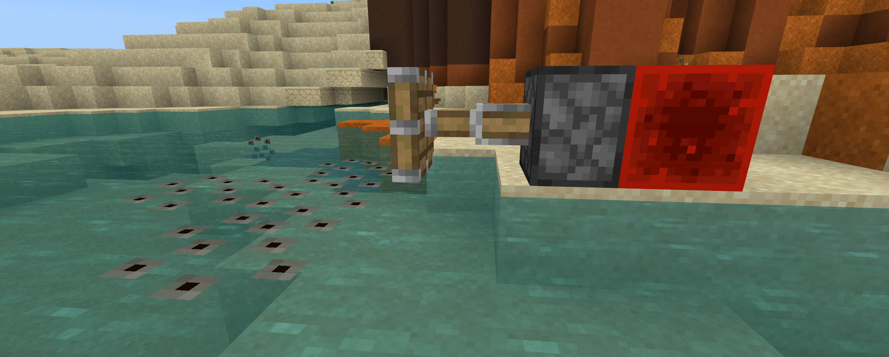
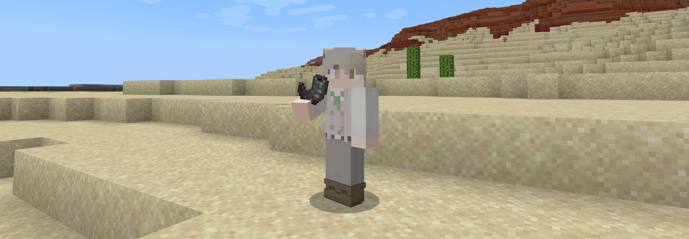
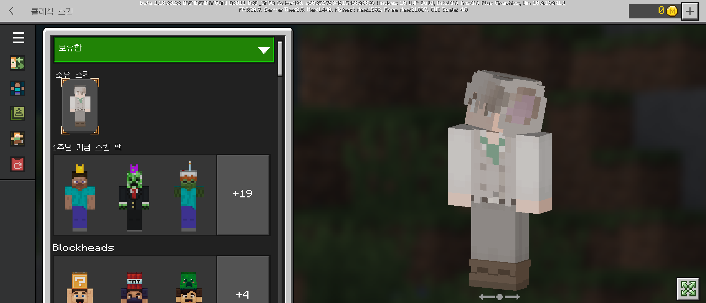
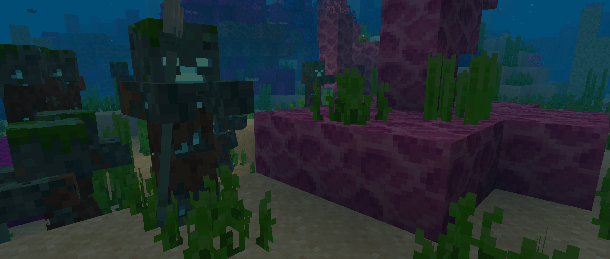

# 베드락 에디션 베타 1.18.20.23 ([프리뷰](https://www.koreaminecraft.net/update/3094908) 1.18.20.24)
## 개구리 이상한거 먹어요

{실험적 기능} 변경 사항
=

개구리
-
* **개구리는 슬라임 볼로 교배시킬 수 있어요.**
* **올챙이 체력이 6으로 늘어났어요.**
* 개구리가 점프할 때 이제 점프 애니메이션만 재생돼요.
* 늪지대 개구리의 무게가 10, 머리 크기가 2~5로 변경되었어요.
* `JumpToBlockGoal`이 작은 블록(예: 수련잎)으로도 점프할 수 있도록 수정되었어요.

개구리 생성 (Frog Spawn, 공식 번역 아님)
-
* 이제 피스톤에 밀려나면 깨져요.
* 개구리 생성이 설치되어 있는 물이 사라지면 깨져요.
* 아래에 있는 블록으로 인해 더 이상 부화를 방해받지 않아요.
* `/fill` 명령어로 개구리 생성을 땅이나 수중에 설치할 수 있던 버그가 고쳐졌어요.
* 떨어지는 블록에 깨져요. [MCPE-150781](BUG)

염소 뿔
-
* **염소 뿔에 쿨타임이 추가되었어요.**

변경 사항
=

클래식 스킨
-
* **탈의실에서 나갈 때 커스텀 스킨이 저장되지 않던 버그가 고쳐졌어요.**

몹
-
* **익사자가 밝기 레벨 0 이상에서도 스폰되던 버그가 고쳐졌어요.**

게임플레이
-
* 수선 마법이 가끔 올바른 경험치 양 만큼 수리되지 않던 버그가 고쳐졌어요. [MCPE-120119](BUG)

자바 에디션과 맞춤
-
* 흐르는 물 아래에 있는 드립스톤으로 더 이상 가마솥을 채울 수 없어요.

인터페이스
-
* Pocket UI 프로필 인벤토리 화면의 2x2 조합 화면에서 (몇몇 언어의) 제목이 잘리던 버그가 고쳐졌어요.
* 베타 새로운 월드 만들기 화면 설정이 플레이 세션 간 지속되지 않던 버그가 고쳐졌어요.

아이템
-
* 이미 다른 갑옷이 입혀져 있을 때 커스텀 갑옷이 "사용" 버튼으로 입혀지지 않던 버그가 고쳐졌어요. [MCPE-125323](BUG)

기술적 변경 사항
=

Molang
-
* **AND가 OR보다 더 먼저, 비교 연산자가 동일 연산자보다 더 먼저 연산되도록 변경되었어요.** (연산 성능이 더 좋아질거에요. `min_engine_version` 1.18.20 이상부터 적용되어요. 예를 들어, `A && B || C`는 `(A && B) || C` 순서로 연산되고, `A < B == C > D`는 `(A < B) == (C > D)` 순서로 연산될거에요.)

블록
-
* 투사체가 종에서 이상한 방향으로 튀어나가던 버그가 고쳐졌어요. [MCPE-47847](BUG)

명령어
-
* `/tickingarea` 명령어가 `tick_world` 컴포넌트가 있는 엔티티의 구역을 변경하지 않아요.

구조물 생성 & 행동자 생성
-
* 엔드 기둥 위에서 엔드 크리스탈이 두 번 생성되던 버그가 고쳐졌어요. [MCPE-147817](BUG)

`EatMobGoal`
-
* 이제 플레이어가 대상일 때 시작되지 않아요.

{실험적 기능}
-
* 행동자 속성이 서버와 클라이언트 간에 항상 동기화되지 않던 버그가 고쳐졌어요.

게임테스트 프레임워크
-
* 자세한 업데이트 내용은 공식 변경 로그를 참고해주세요.

### [공식 변경 로그](https://feedback.minecraft.net/hc/en-us/articles/4423906361869) | [마인크래프트 위키](wiki/beta_1.18.20.23)

* 프리뷰는 아직 iOS에서만 사용 가능해요!
