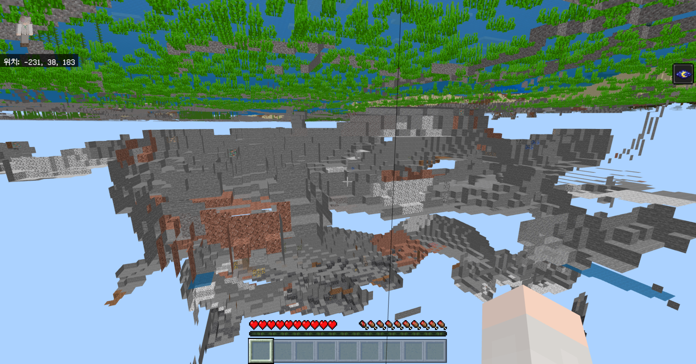
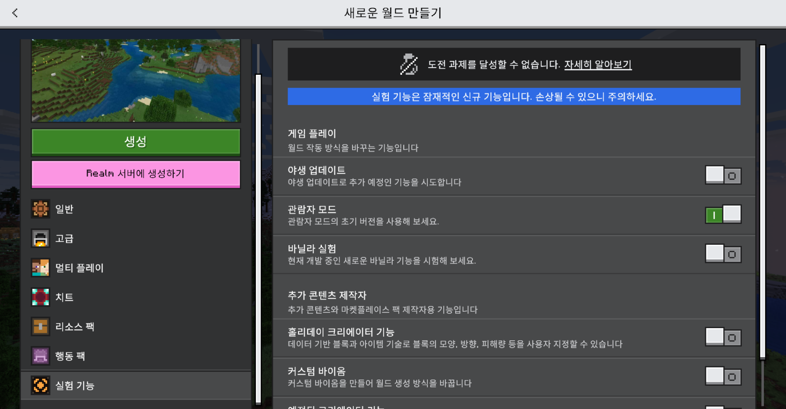
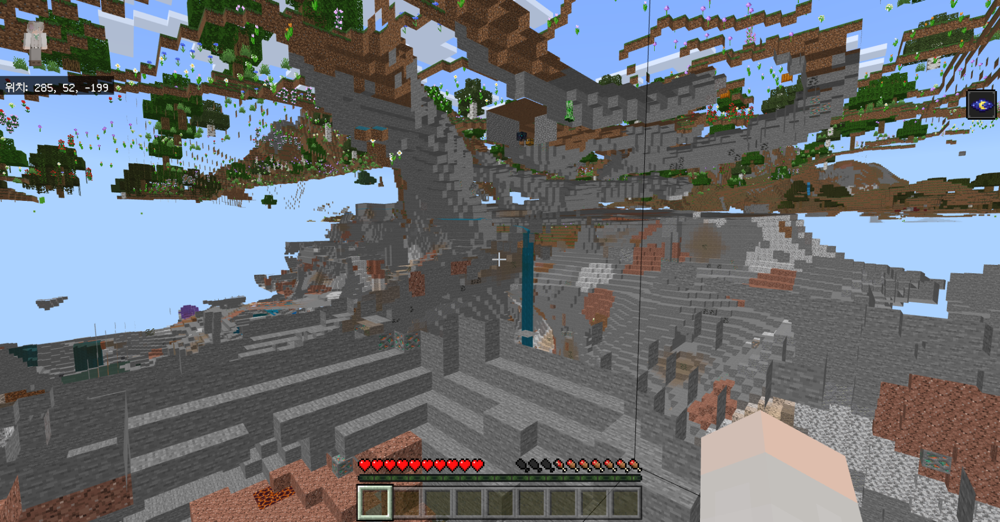
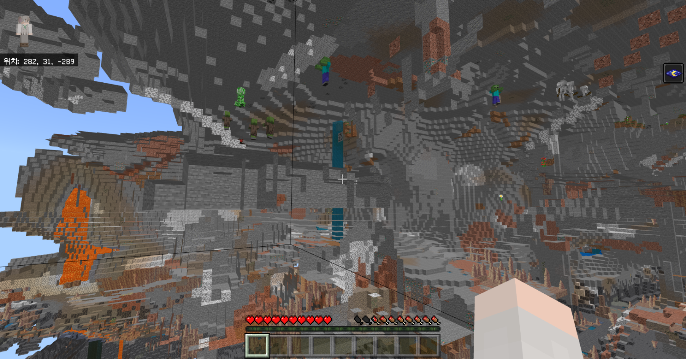
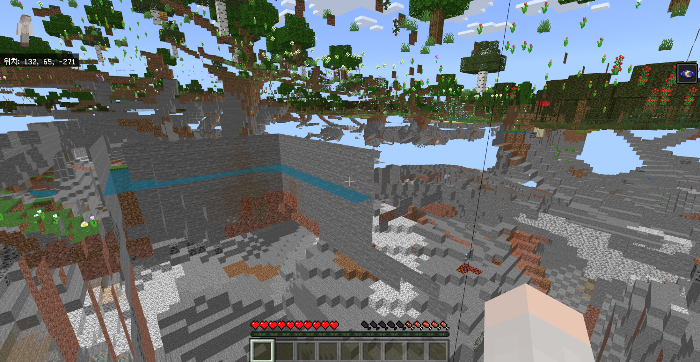
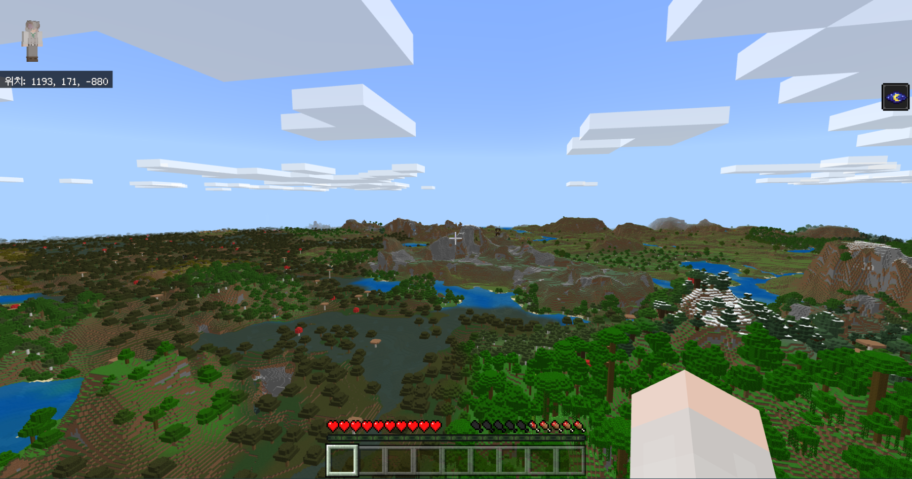

# 베드락 에디션 1.18.31
## ㅘ! 관전 모드가 베드락에!

실험적 기능
=

* **'관람자 모드' 실험적 기능이 추가되었어요.** 관람자 모드의 초기 개발 버전을 사용해볼 수 있어요.(관람자 모드는 아직 초기 개발 버전이라 따로 버그 신고를 받지 않아요.)

변경 사항
=

* **월드 버전이 1.18.30으로 업데이트된 후 열리지 않던 버그가 고쳐졌어요.**
* 게임플레이 중 발생할 수 있던 여러 충돌이 고쳐졌어요.
* 화로로 경험치를 복제할 수 있던 치트가 고쳐졌어요. [MCPE-152227](BUG)
* 로드되지 않은 청크로 엔티티가 순간이동했을 때 더 이상 엔티티가 삭제되지 않아요.
* RTX 월드를 다시 불러올 때 화면이 까맣게 변하던 버그가 고쳐졌어요. [MCPE-152645](BUG)
* 안드로이드 기기에서 멀리 있는 블록이 거칠거나, 뒤틀리거나, 왜곡된 것처럼 보이던 버그가 고쳐졌어요. [MCPE-141316](BUG)
* iOS 기기에서 흐르는 물과 용암 텍스쳐가 제대로 나타나지 않던 버그가 고쳐졌어요.
* 주로 성능이 저하된 기기에서 나타나던 여러 프레임 저하 상황이 고쳐졌어요. [MCPE-142934](BUG)
* 몹은 더 이상 버튼 위에 생성되지 않아요. [MCPE-153897](BUG)
* 특정 청크를 반복적으로 저장하고 불러오는 과정에서 청크 로딩이 느려지고, 성능이 저하되고, 게임이 불안정해지던 버그가 고쳐졌어요. [MCPE-154110](BUG) [MCPE-154278](BUG)
* "사운드 오브 뮤직" 도전과제의 조건이 충족되면 이제 잘 달성돼요.
* 닌텐도 스위치에서 마켓플레이스가 열리지 않던 버그가 고쳐졌어요. [MCPE-154120](BUG)
* 마켓플레이스에서 구매할 때 한무 로딩 화면이 뜨던 버그가 고쳐졌어요.

### [공식 변경 로그](https://feedback.minecraft.net/hc/en-us/articles/5842521639693-Minecraft-1-18-31-Bedrock-) | [마인크래프트 위키](wiki/1.18.31)